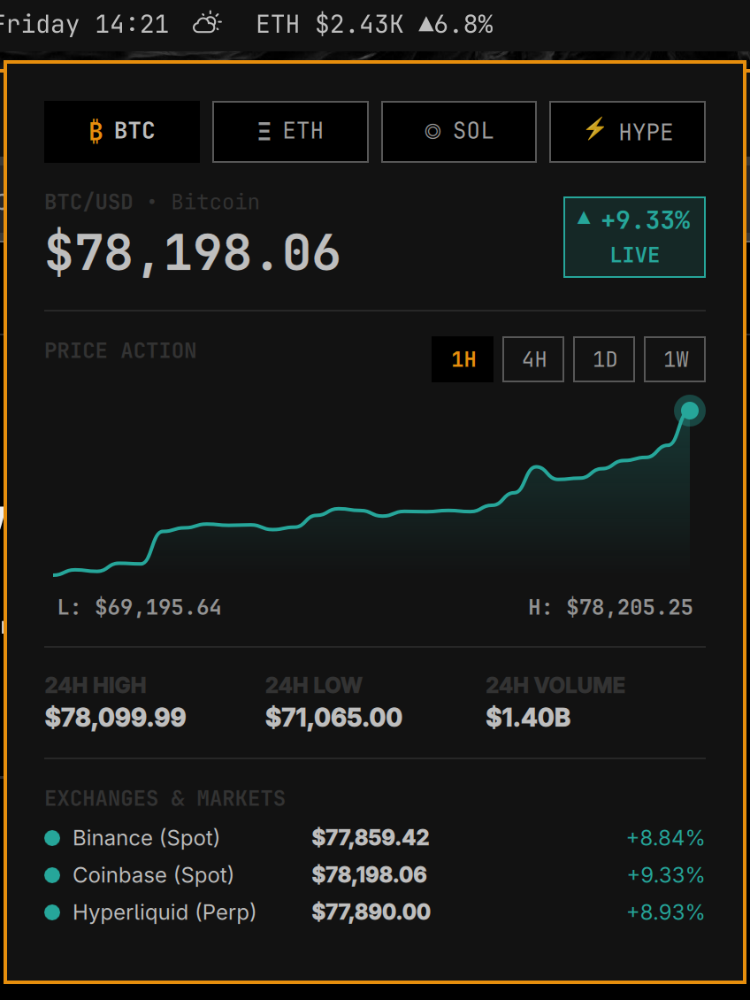

# Omarchy Market (`io.github.dpr.omarchy-market`) v1.2.1

A production-quality, native financial market data ticker and compact terminal plugin for **Omarchy Quattro**.



---

## Features

- **Dynamic Watchlist & Market Catalog**:
  - Add, remove, and reorder up to **20 crypto & stock markets**.
  - Curated US equity coverage (e.g. `AAPL`, `MSFT`, `NVDA`, `AMZN`, `GOOGL`, `META`, `TSLA`, `AVGO`, `AMD`, etc.).
  - **Dynamic Stock Search**: Search and add arbitrary stocks and ETFs beyond the static catalog via unauthenticated Yahoo Finance search with clean, isolated persistence.
  - Integrated search engine with alias resolution (e.g. `apple` → `AAPL`, `nvidia` → `NVDA`, `dogecoin` → `DOGE`, `bitcoin` → `BTC`, `ether` → `ETH`).
  - Locally persisted via Qt `Settings` with automatic migration and schema versioning.
  - Horizontally scrollable asset tab bar with reactive gradient edge-fade scroll affordances that indicate available scrollable content.
- **Native Quattro Watchlist Manager**:
  - Dedicated `⚙` settings control adjacent to asset tabs.
  - Live search dropdown with instant `+ Add` action for catalog and remote stock search results with asset class tags (`STOCK` / `CRYPTO`).
  - Active watchlist list with `↑` / `↓` reordering and `✕` deletion.
- **Live Streaming Multi-Provider Feeds**:
  - **Yahoo Finance**: Direct HTTP Chart API integration with strict rate-limiting serialization and session handling (Regular, Pre-Market, Post-Market, Closed).
  - **Binance**: Public spot ticker WebSocket streams & REST klines with dynamic subscriptions.
  - **Coinbase**: Advanced Trade public ticker WebSocket feeds with dynamic IPC channel subscriptions. Unsupported historical candle granularities (4H, 1W) are cleanly blocked at provider entry.
  - **Hyperliquid**: Real-time mid prices & market contexts (native DEX home of `HYPE`).
- **Distinct Instrument & Pricing Engine**:
  - Distinguishes spot markets (`BTC/USDT`, `BTC/USD`), equities (`AAPL`, `NVDA`), and perpetuals (`HYPE`, `BTC-PERP`).
  - Calculates Reference Spot Price across active spot feeds without cross-market distortion.
  - Routes equities to Yahoo and DEX-native tokens directly to their native feeds.
  - **Deterministic Historical Candle Routing**: Centralized historical provider resolution (Spot Crypto -> Binance with Hyperliquid fallback; Perps -> Hyperliquid; Equities -> Yahoo) avoiding multi-provider data races and payload collisions.
- **Compact Market Terminal Panel**:
  - Large price display with color-coded 24h change & freshness indicator (`LIVE`, `STALE`, `OFFLINE`).
  - 24h High, Low, and USD Volume statistics.
  - Multi-exchange comparison table showing live prices across Yahoo Finance (for stocks) or Binance, Coinbase, and Hyperliquid (for crypto).
  - Native QML Canvas sparkline chart with timeframe selectors (`1H`, `4H`, `1D`, `1W`).
  - **Native Chart Hover Inspection**: Crosshair hairline, highlighted data point glow, and formatted date/time and price badge without external charting libraries.
  - Subdued baseline loading state eliminating artificial 3-point synthetic lines on asset or timeframe switches.
  - Single-click `+ Add to Watchlist` action on the asset header.
- **Zero Cost & Zero Daemon**:
  - $0 operating cost, zero API keys required, zero paid backends.
  - No background daemons, no extra Quickshell processes, no systemd units, no sudo needed.
- **Resilient & Isolated**:
  - Single active HTTP request invariant for Yahoo with minimum 1200ms spacing and exponential backoff with jitter on HTTP 429/5xx.
  - Dynamic subscription updates over `stdin` without restarting unaffected feeds.
  - Automatic reconnection with exponential backoff and jitter.
  - Independent provider failure isolation (one exchange going down does not disrupt the others or block watchlist editing).
  - Clean process teardown on disable or shell reload with zero orphaned child processes.

> **Stock Market Data Notice**:
> Stock market data is provided through Yahoo Finance's unofficial Chart API. Availability, rate limits, symbol coverage, delays, and endpoint behavior are controlled by Yahoo Finance and may change without notice.

---

## Prerequisites & Dependencies

- **Desktop Shell**: Omarchy Quattro (`omarchy-shell` / Quickshell `0.3.0`+, Qt `6.8`+).
- **Runtime Transport**: `node` (Node.js v20+, v22+, or v26+ with native WHATWG `WebSocket` support, 0 npm packages required).

---

## Installation

### Method 1: Automatic via Omarchy CLI
```bash
omarchy plugin add https://github.com/DPRC137/omarchy-market.git --enable --yes
```

### Method 2: Manual Installation
1. Clone or symlink into your Omarchy plugins directory:
   ```bash
   git clone https://github.com/DPRC137/omarchy-market.git ~/.config/omarchy/plugins/io.github.dpr.omarchy-market
   ```
2. Rescan and enable:
   ```bash
   omarchy-shell shell rescanPlugins
   omarchy plugin enable io.github.dpr.omarchy-market
   ```

## Removal

### Automatic via Omarchy CLI
```bash
omarchy plugin remove io.github.dpr.omarchy-market
```

### Manual Removal
```bash
rm -rf ~/.config/omarchy/plugins/io.github.dpr.omarchy-market
omarchy-shell shell rescanPlugins
```

---

## Usage & Controls

- **Left-Click** on the bar ticker: Opens / closes the compact Market Terminal popup.
- **Middle-Click**: Forces an immediate market data refresh across all providers.
- **Right-Click**: Cycles the active single-asset display in compact mode.
- **Watchlist Settings (`⚙`)**: Opens the native Watchlist Manager to search, add, reorder, and remove assets.
- **Keyboard in Terminal**:
  - `Tab` / `Shift+Tab`: Switch between watchlist asset tabs.
  - `R`: Refresh market data.
  - `Escape`: Close Watchlist Manager / close terminal popup.

---

## Configuration (`shell.json`)

Settings can be customized directly in `~/.config/omarchy/shell.json`:

```json
{
  "id": "io.github.dpr.omarchy-market",
  "multiAsset": false,
  "speed": 4000
}
```

- `multiAsset` *(boolean)*: Toggle between full multi-asset scrolling ticker and single-asset compact cycling mode.
- `speed` *(number)*: Multi-asset cycling interval in milliseconds (default: `4000`).

---

## Development & Testing

- Run the automated test suite:
  ```bash
  ./tests/run_tests.sh
  ```
- Run fault-injection tests:
  ```bash
  ./tests/test_fault_injection.sh
  ```
- Run live integration connectivity tests:
  ```bash
  ./scripts/live-test.sh
  ```
- Monitor live resource usage:
  ```bash
  ./tests/measure_resources.sh
  ```
